# Project Title

# *PlantCare Detect and Cure*

### Problem Statement:
PlantCare Detect and Cure addresses the challenge of identifying and managing plant diseases using image classification. By leveraging advanced deep learning techniques, this project aims to accurately classify plant images into specific disease categories and provide actionable cure information. This solution helps farmers and gardeners quickly diagnose plant health issues, leading to timely and effective treatment, ultimately enhancing crop yield and plant health.


# Types of Diseases in the dataset 


1. **Apple**: Apple Scab, Black Rot, Cedar Apple Rust, Healthy
2. **Blueberry**: Healthy
3. **Cherry (Including Sour)**: Powdery Mildew, Healthy
4. **Corn (Maize)**: Cercospora Leaf Spot Gray Leaf Spot, Common Rust, Northern Leaf Blight, Healthy
5. **Grape**: Black Rot, Esca (Black Measles), Leaf Blight (Isariopsis Leaf Spot), Healthy
6. **Orange**: Huanglongbing (Citrus Greening)
7. **Peach**: Bacterial Spot, Healthy
8. **Pepper (Bell)**: Bacterial Spot, Healthy
9. **Potato**: Early Blight, Late Blight, Healthy
10. **Raspberry**: Healthy
11. **Soybean**: Healthy
12. **Squash**: Powdery Mildew
13. **Strawberry**: Leaf Scorch, Healthy
14. **Tomato**: Bacterial Spot, Early Blight, Late Blight, Leaf Mold, Septoria Leaf Spot, Spider Mites (Two-spotted Spider Mite), Target Spot, Tomato Yellow Leaf Curl Virus, Tomato Mosaic Virus, Healthy


# Features:
- **Login System:** Secure user authentication with email and password.
- **Dashboard:** Personalized user dashboard upon successful login.
- **Disease Detection:** Identifies plant diseases from images using a deep learning model.
- **Disease Classification:** Provides specific disease names and corresponding cure information.
- **Image Upload:** Upload and analyze images of plants to detect diseases.
- **Base64 Image Encoding:** Converts images to Base64 format for web display.
- **User Activity Logging:** Records login and logout activities, including duration, in an Excel file.


## 🔗 Links
[](https://aicraftalchemy.github.io/)
[](https://www.linkedin.com/in/lokesh-e-60a583201)


## 🛠 Skills
Machine Learning, Deep Learning ,Pytorch


## Installation
  
 ```bash
   python 3.11.9
   mysql
```


    

# Learnings and Challenges
   
#### Learnings:
- **Model Implementation**: Successfully deployed VGG19 using the `timm` library for plant disease classification within a Flask application. 
- **Layer Freezing**: Encountered challenges with freezing specific layers of the pre-trained model to balance between learning new features and preserving learned ones.
- **Image Processing**: Developed robust image preprocessing pipelines including resizing, normalization, and tensor conversion for effective model input.
- **Activity Logging**: Implemented functionality to log user activities (login/logout) with timestamps and duration, saving this data in an Excel file for tracking and analysis.
- **Image Encoding**: Addressed the need to encode images in base64 format for seamless web display, ensuring compatibility and efficient data transfer.
- **Cure Information**: Integrated detailed plant disease cure information, providing users with actionable insights based on model predictions.

---


### Optimizations

1. **Pre-trained Model**: Used VGG19 with pre-trained weights for faster and more accurate predictions.
2. **Layer Freezing**: Frozen initial layers to speed up inference and avoid retraining.
3. **Efficient Image Processing**: Applied transformations and normalization to ensure consistent model input.
4. **No Gradient Calculation**: Enabled `torch.no_grad()` to reduce memory usage during inference.
5. **Base64 Encoding**: Converted images to base64 for seamless display in web responses.
6. **Batch Prediction**: Processes images in batches, improving scalability.
7. **Softmax for Confidence**: Provides clear, interpretable probability scores for predictions.
8. **Inference Optimization**: `model.eval()` and `torch.no_grad()` ensure faster and memory-efficient inference.
9. **Flask Scalability**: Efficient handling of file uploads and image processing with minimal memory overhead.

## Run Locally

Clone the project

```bash
  git clone https://link-to-project
```

Go to the project directory

```bash
  cd my-project
```

Install dependencies

```bash
  pip install -r requirements.txt
```

Start the server in terminal

```bash
  python app.py
```
Start the detection server in terminal in detection folder

```bash
  python app.py
```
- use the 5000 port server(first server) and both servers are inter-linked

### Screenshots

Below are screenshots demonstrating the project:

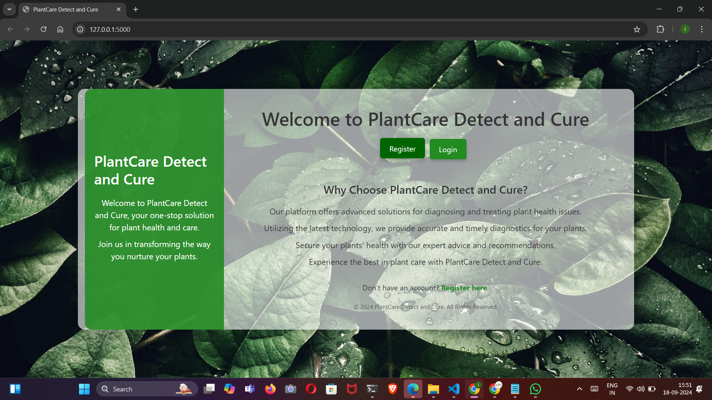
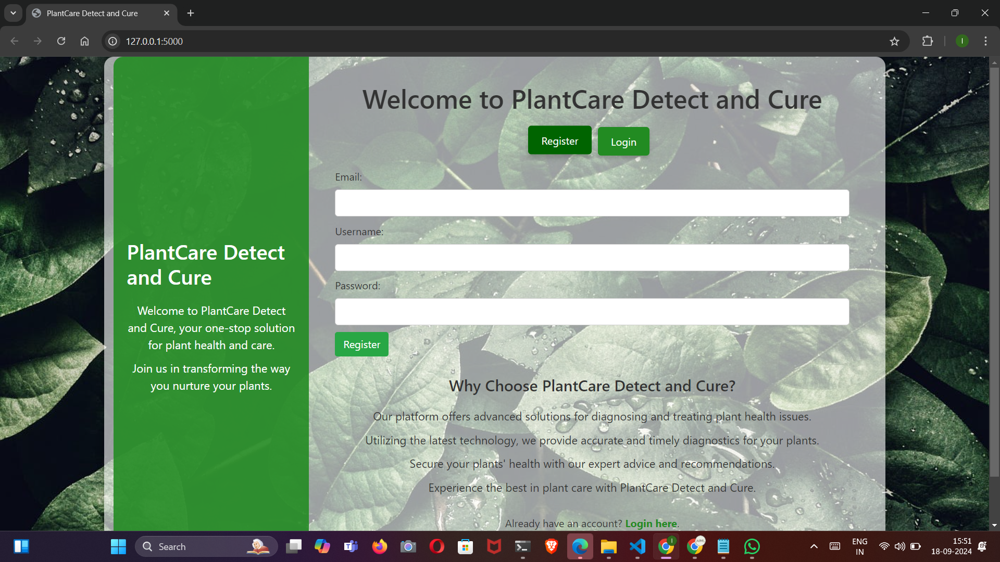
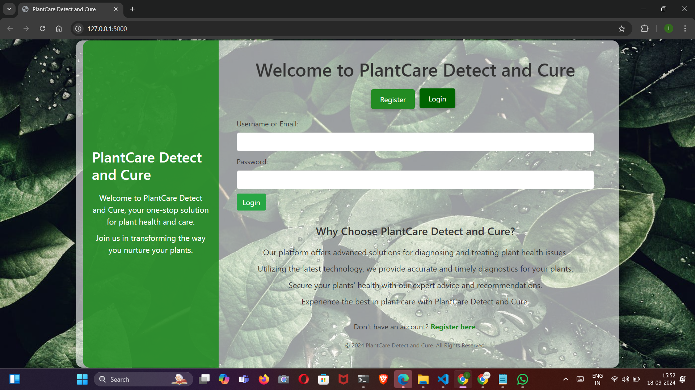
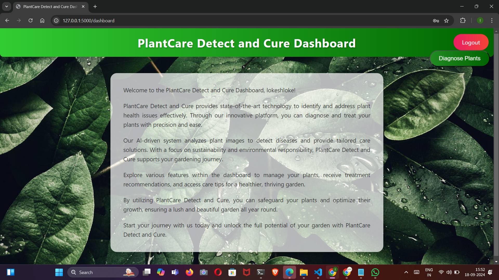
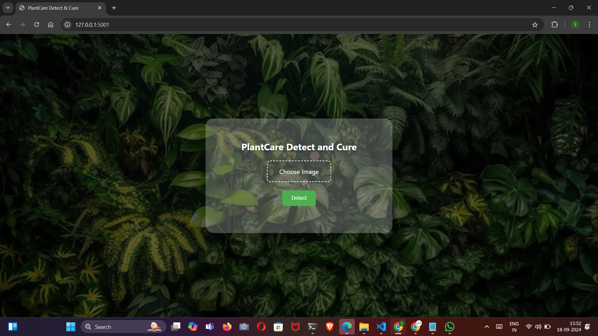
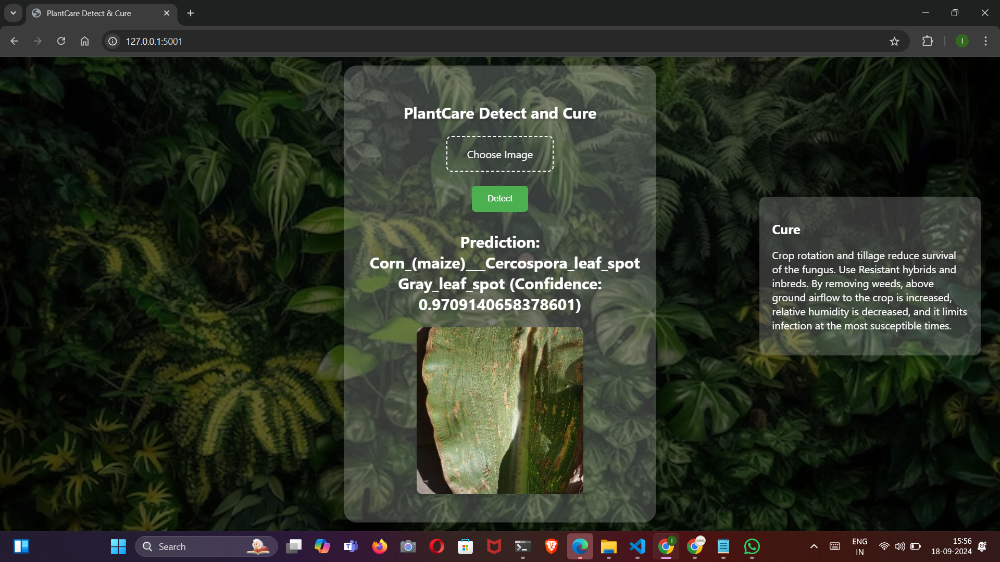
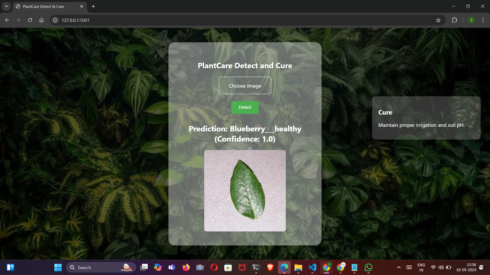
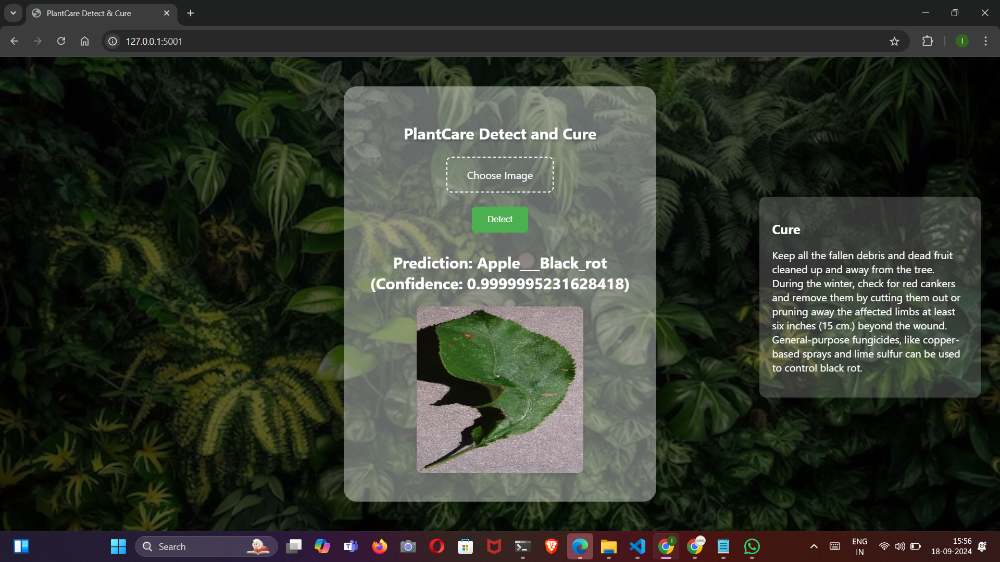
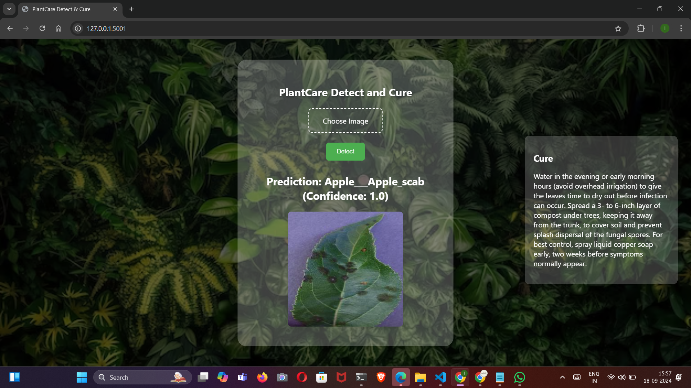
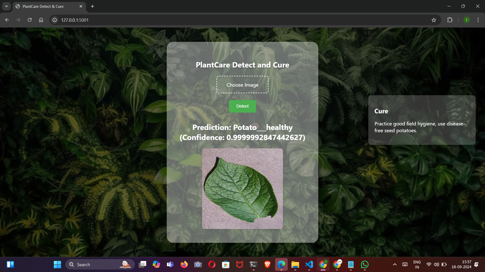
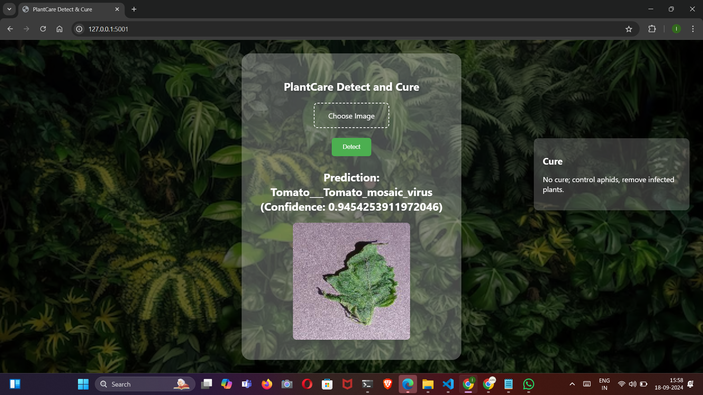
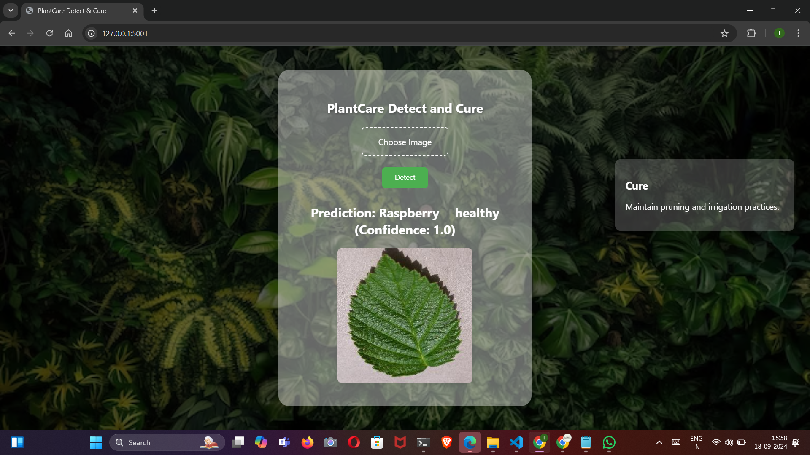
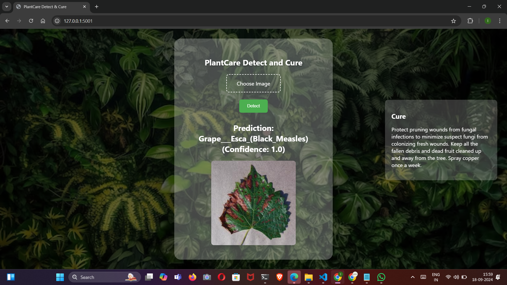
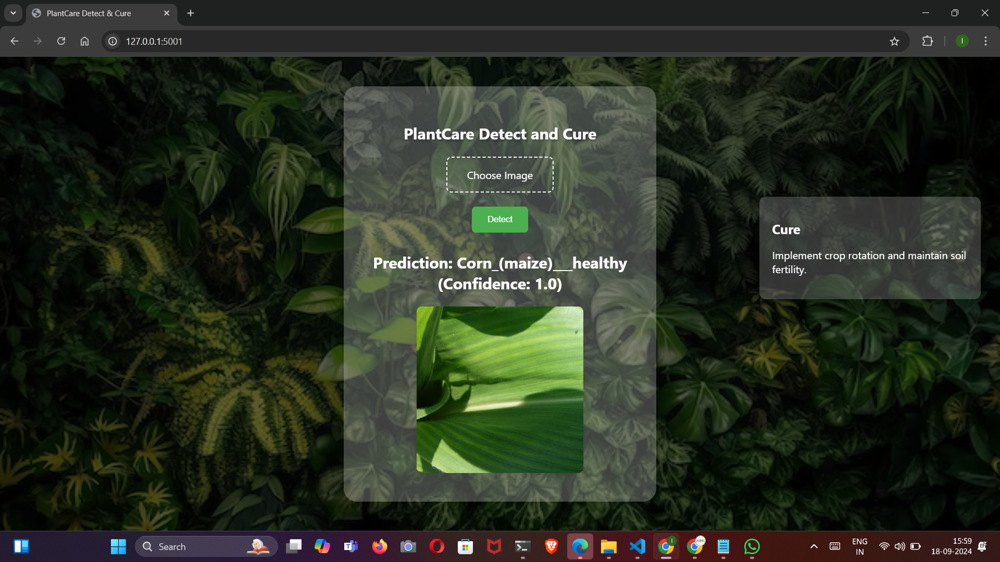
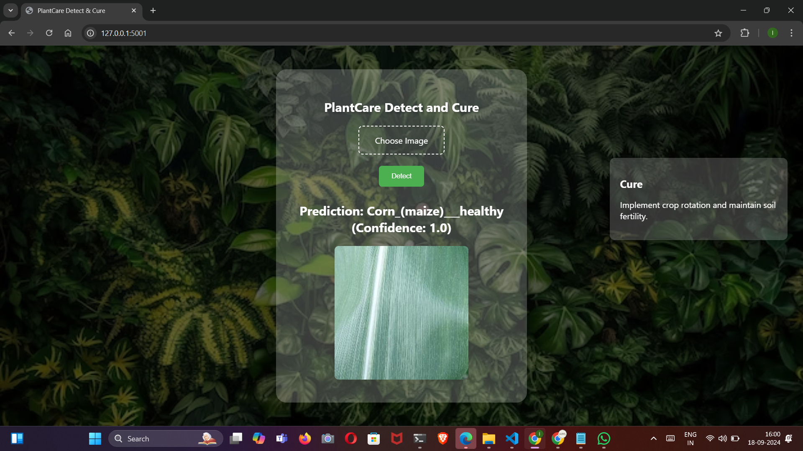
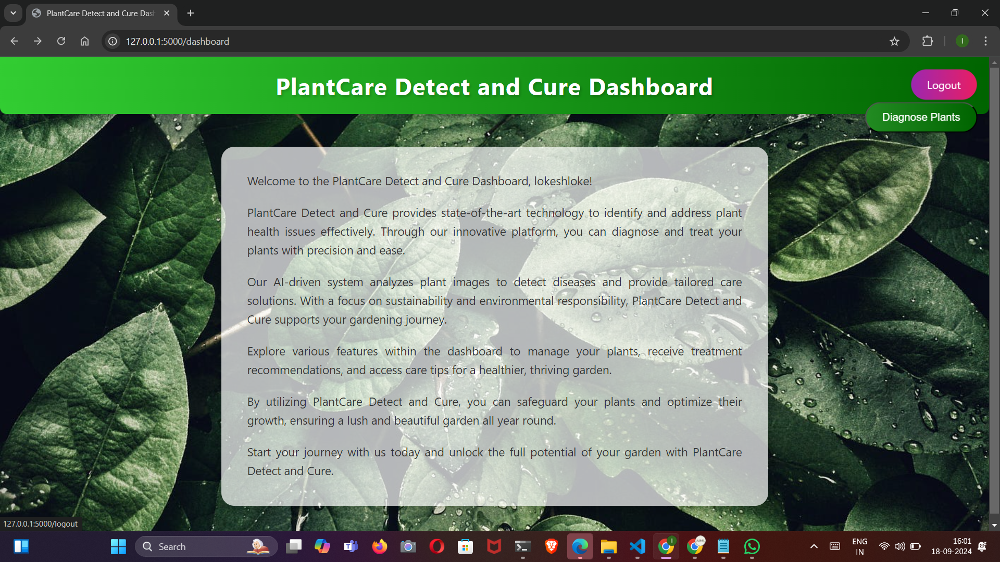


These images showcase the functionality and user interface of the application.
## Support

For support, email aicraftalchemy@gmail.com 


## Feedback

If you have any feedback, please reach out to us at aicraftalchemy@gmail.com

Phone: +91 7661081043

